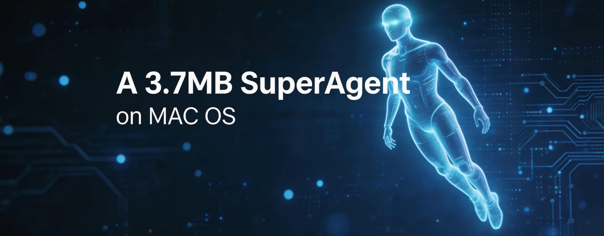
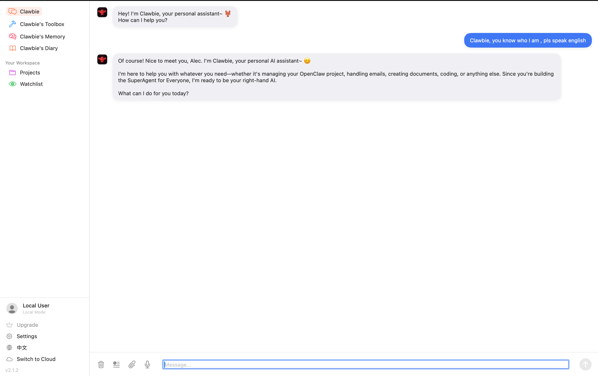
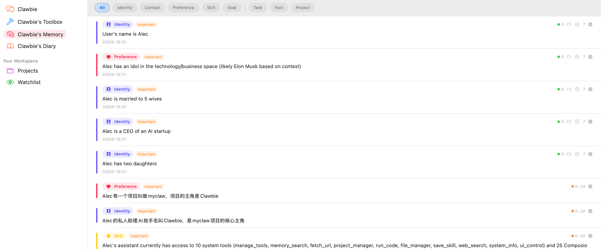
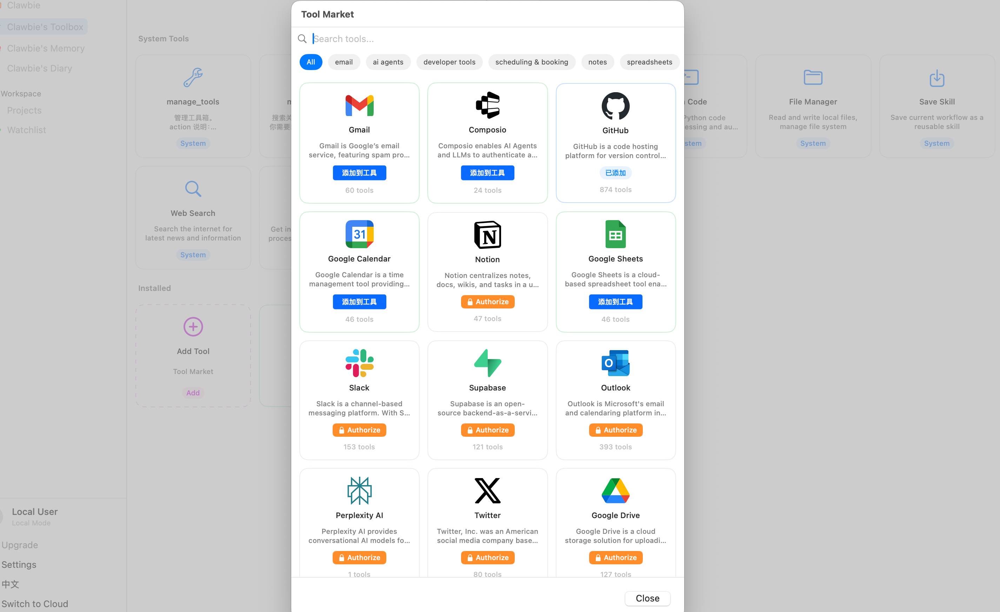
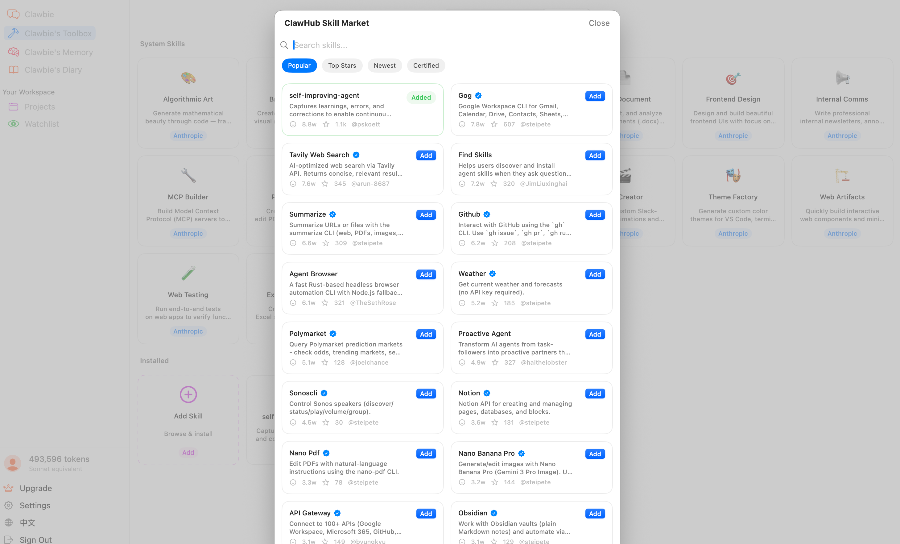
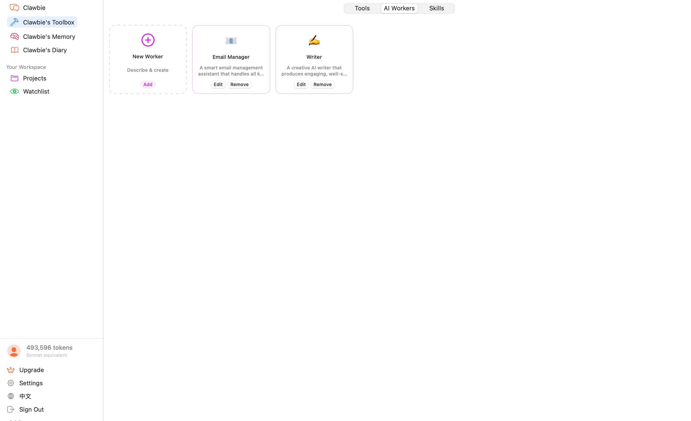

<p align="center">
  
</p>

<p align="center">
  <strong>A 3.7MB SuperAgent on macOS</strong><br>
  Pure Swift. Zero dependencies. One native binary.
</p>

<p align="center">
  <a href="https://myclaw.studio">myclaw.studio</a> — Watch the demo video and download the latest build to try Local Mode instantly.
</p>

<p align="center">
  
  
  
  
  
</p>

<p align="center">
  <a href="#features">Features</a> &bull;
  <a href="#installation">Installation</a> &bull;
  <a href="#getting-started">Get Started</a> &bull;
  <a href="#architecture">Architecture</a> &bull;
  <a href="#contributing">Contributing</a> &bull;
  <a href="#license">License</a>
</p>

---

## Features

### Clawbie — Your Personal AI Assistant

MyClaw is not another Electron wrapper. It's a **3.7MB native macOS app** built entirely in Swift — no Python, no Node.js, no web views. Just a single binary that talks directly to your AI provider.

Bring your own API key (Claude, OpenAI, Gemini, DeepSeek, and more), and Clawbie becomes your personal desktop AI with full access to your Mac.

<p align="center">
  
</p>

---

### 4-Layer Instant Memory — Gets Smarter the More You Use It

Clawbie doesn't forget. A 4-layer memory architecture automatically extracts and organizes what matters:

- **Sub-core Memory** — Your identity, preferences, habits, and goals
- **General Memory** — Tasks, events, facts, and project context
- **Core Memory** — An AI-distilled profile, auto-refreshed every 2 hours
- **Diary** — First-person daily reflections on your conversations

All memories are stored locally and searchable with fuzzy matching (works for all languages including CJK).

<p align="center">
  
</p>

---

### 900+ MCP Tools — One Click to Connect

Browse and install from the Composio marketplace — Gmail, Slack, GitHub, Google Calendar, Notion, and hundreds more. OAuth authorization opens in your browser; Clawbie gets the tools instantly.

MyClaw is also a full **MCP (Model Context Protocol)** client. Install any MCP-compatible server and your AI gains new capabilities on the fly.

<p align="center">
  
</p>

---

### 16,000+ Skills from ClawHub

One-click install from the ClawHub skill market — pre-built AI workflows for coding, research, writing, data analysis, and more. Or create your own and share them with the community.

<p align="center">
  
</p>

---

### AI Workers — Autonomous Agents

Create specialized agents with custom system prompts, selective tool access, and independent execution. Describe what you need and let MyClaw generate the agent for you.

<p align="center">
  
</p>

---

### All Data Stays Local

In Local Mode (default for open source), everything runs on your Mac:

- API keys stored in macOS UserDefaults — never sent anywhere except direct provider calls
- All memories, chat logs, skills, and configs at `~/.aichat/`
- No account required, no login, no cloud dependency
- Bring your own key and start chatting immediately

---

## Installation

### Download from Website

Visit **[myclaw.studio](https://myclaw.studio)** to download the latest DMG for Apple Silicon or Intel.

### Build from Source

```bash
git clone https://github.com/myclaw-studio/myclaw-studio-macos.git
cd myclaw-studio-macos

# Build, sign, create DMG, install, and launch
./package.sh

# Or open in Xcode
open AIChat/AIChat.xcodeproj
# Select scheme "AIChat" → My Mac → Build & Run
```

**Requirements:** macOS 14.0+, Xcode 15.0+

---

## Getting Started

1. **Launch** MyClaw from `/Applications`
2. **Settings** → Enter your API key (Anthropic, OpenAI, Gemini, etc.)
3. **Chat** — Ask Clawbie anything:
   - *"Search the web for the latest macOS release notes"*
   - *"Create a Python script that converts CSV to JSON"*
   - *"Open Safari and take a screenshot"*
   - *"Read my project files and suggest improvements"*
4. **Extend** — Install MCP tools or Composio integrations to give Clawbie new capabilities

---

## Architecture

```
+---------------------------------------------+
|              SwiftUI Frontend                |
|   ContentView - ChatView - SettingsView     |
+---------------------------------------------+
|         WebSocket (ws://127.0.0.1:8000)      |
+---------------------------------------------+
|          Swift HTTP Backend Server           |
|  +-------------+  +----------------------+  |
|  | Chat Handler |  |   REST API Routes    |  |
|  |  (WebSocket) |  | /agents /skills /mem |  |
|  +------+------+  +----------------------+  |
|         |                                    |
|  +------v----------------------------------+ |
|  |       Agent Orchestrator (ReAct)        | |
|  |  LLM Call -> Tool Execution -> Loop     | |
|  +------+----------------------------------+ |
|         |                                    |
|  +------v------+ +--------+ +-----------+   |
|  | System Tools| |  MCP   | | Composio  |   |
|  |  (10 built- | |Servers | |  (900+    |   |
|  |   in tools) | |(stdio) | |   tools)  |   |
|  +-------------+ +--------+ +-----------+   |
+---------------------------------------------+
|          OS Bridge (port 8001)              |
|     macOS Accessibility API proxy           |
+---------------------------------------------+
```

- **100% Swift** — No Electron, no Python, no Node.js
- **Zero dependencies** — Built on Apple system frameworks only
- **Embedded server** — HTTP + WebSocket on `127.0.0.1:8000`
- **ReAct agent** — Up to 30 steps of reasoning + tool execution per turn

---

## Contributing

We welcome contributions! See [CONTRIBUTING.md](CONTRIBUTING.md) for guidelines.

```bash
git clone https://github.com/myclaw-studio/myclaw-studio-macos.git
cd myclaw-studio-macos
open AIChat/AIChat.xcodeproj
```

---

## License

MIT License. See [LICENSE](LICENSE).

---

<p align="center">
  <sub>Built with pure Swift. No Electron. No dependencies. Just a 3.7MB native Mac app.</sub>
</p>
